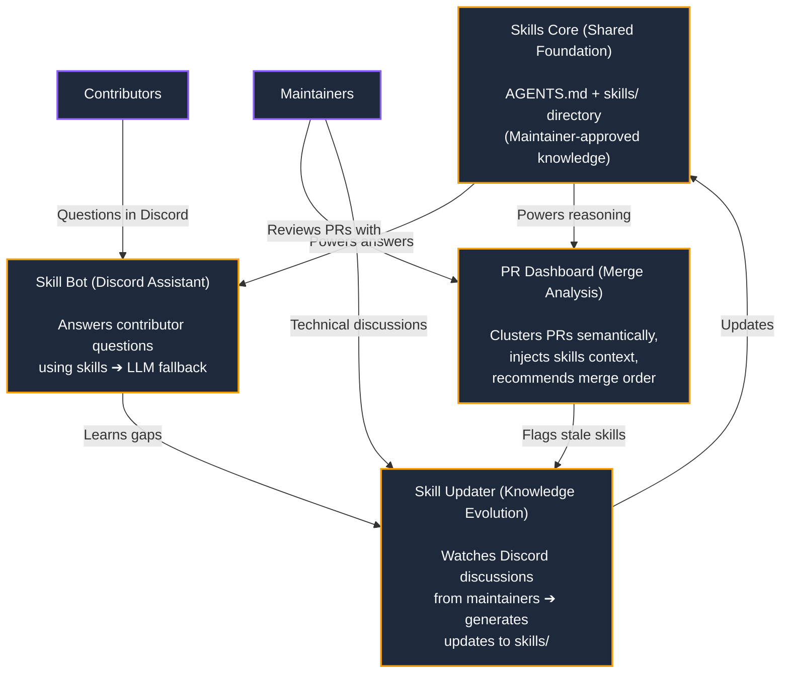
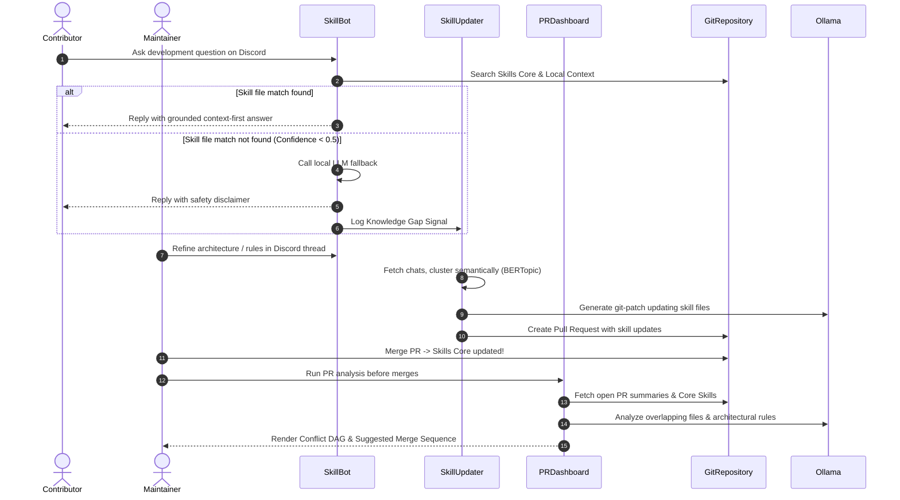

<!-- Don't delete it -->
<div name="readme-top"></div>

<!-- Organization Logo -->
<div align="center" style="display: flex; align-items: center; justify-content: center; gap: 16px;">
  
  
</div>

&nbsp;

<!-- Organization/Project Badges -->
<div align="center">

[](https://kpj2006.github.io/InteractiveSimulation/)

</div>

<!-- Organization/Project Social Handles -->
<p align="center">
<!-- Telegram -->
<a href="https://t.me/StabilityNexus">
</a>
&nbsp;&nbsp;
<!-- X (formerly Twitter) -->
<a href="https://x.com/aossie_org">
</a>
&nbsp;&nbsp;
<!-- Discord -->
<a href="https://discord.gg/hjUhu33uAn">
</a>
&nbsp;&nbsp;
<!-- Medium -->
<a href="https://news.stability.nexus/">
  </a>
&nbsp;&nbsp;
<!-- LinkedIn -->
<a href="https://www.linkedin.com/company/aossie/">
  </a>
&nbsp;&nbsp;
<!-- Youtube -->
<a href="https://www.youtube.com/@AOSSIE-Org">
  </a>
</p>

---

<div align="center">
<h1>AOSSIE Skills Ecosystem</h1>
<h3>Contextual Contribution Governance Infrastructure</h3>
</div>

The **AOSSIE Skills Ecosystem** is a local-first, context-first AI governance infrastructure that implements the Agentic AI Foundation's (AAIF) open standards for agentic repository customization. Across large organizations hosting hundreds of repositories, AI-assisted tools frequently suggest incorrect code or violate project boundaries due to a lack of repository context. 

This is a scalable, end-to-end repository governance system designed to ensure zero knowledge loss. It automatically catches insights from developer discussions to update repository skill files, runs community bots to resolve contributor questions, and displays a dashboard that highlights conflict warnings, suggested replies for ambiguous contributor PRs, and recommended merge sequences. If any knowledge is missing, it logs a gap signal to capture it later.

🔒 Local-First, Private & Scalable: Tested on servers with over 8,000+ members, the entire system is free, open-source, and runs fully on local LLMs—meaning zero info leaks, absolute data privacy, and zero SaaS costs, all while keeping a human in the loop.

---

##  Ecosystem Modules

* **Organization-Wide Skills Core**: A centralized repository storing standard, reusable organizational skills and policies (e.g., onboarding, AI safety policies) synchronized across all projects.
* **Per-Repository Customization (`AGENTS.md` & `.agents`)**: Local repository configuration files defining strict physical boundaries, whole repository context, architectural constraints, and more about that project.
* **Skill Bot (Discord Assistant)**: Answers contributor queries by vector-searching local/global skill files and logging knowledge gaps.
* **Skill Updater Pipeline**: Automatically polls maintainer chats, clusters discussions semantically using BERTopic, and drafts Git Pull Requests to update project skills with new decisions.
* **PR Dashboard (Conflict DAG)**: Fetches open PRs, extracts summaries, clusters overlapping files, and runs local model inference to render a dependency DAG highlighting merge sequences and conflicts.
* upcoming: PR Skill Updater, cross-repo skills manager

---

## 💻 Tech Stack

* **Programming Languages**: Python, TypeScript, HTML5, CSS3, JavaScript
* **Integration APIs & Frameworks**: Discord.py, GitHub CLI (`gh`), Git, Jinja2
* **NLP & Topic Clustering**: sentence-transformers (`all-MiniLM-L6-v2`), BERTopic, IncrementalPCA, MiniBatchKMeans, NetworkX
* **Local LLM & Vector DB**: Ollama (`qwen2.5:7b` / `llama3`), ChromaDB (Persistent multi-repo vector indexing), `nomic-embed-text`

---


## 🔗 Repository Links

1. [Skills Core Repository](https://github.com/AOSSIE-Org/Skills)
2. [Interactive Simulation](https://github.com/kpj2006/InteractiveSimulation) (Live Demo: [demo](https://kpj2006.github.io/InteractiveSimulation/))
3. [Pull Request Dashboard](https://github.com/AOSSIE-Org/PullRequestDashboard)
4. [Skill Bot Assistant](https://github.com/AOSSIE-Org/SkillBot)
5. [Skill Updater Pipeline](https://github.com/kpj2006/skill-updater)

---

## 🏗️ Architecture Diagram



---

## 🔄 User Flow



### Key User Journeys

1. **Developer Setup & FAQ Support**:
   * **Step 1**: A contributor posts a query (e.g., "How do I build and run tests?") in Discord.
   * **Step 2**: Skill Bot creates a scoped thread, retrieves relevant chunks from ChromaDB, and replies.
   * **Step 3**: If details are missing, Skill Bot logs a gap signal, prompting the local LLM to reply with a fallback guardrail.
2. **Interactive Simulation Walkthrough**:
   * **Step 1**: Open the [Interactive Simulation](https://kpj2006.github.io/InteractiveSimulation/) dashboard.
   * **Step 2**: Select a Scenario (A, B, or C) from the control panel.
   * **Step 3**: Click **Trigger Step** or **Auto-Play** to watch visual data packets flow between components (Bot, Dashboard, Updater, Repo) in real-time.
4. **Pull Request Conflict Resolution**:
   * **Step 1**: Maintainer starts the PR Dashboard tool.
   * **Step 2**: The tool fetches active PR summaries and renders an interactive HTML report mapping dependencies.
   * **Step 3**: The maintainer follows the recommended merge order (e.g. merge ORM setup first, rebase direct client next) to minimize manual refactoring.

---

## 🏁 Getting Started

### Prerequisites

Ensure you have the following installed on your local machine:
* **Python 3.10+** and **Node.js 18+**
* **Ollama** running locally:
  * Pull embed model: `ollama pull nomic-embed-text`
  * Pull inference model: `ollama pull qwen2.5:7b` (or `llama3`)
* **GitHub CLI (`gh`)** installed and authenticated with your GitHub account.

### Installation & Setup

#### 1. Clone the Repository
```bash
git clone https://github.com/AOSSIE-Org/Skills.git
cd Skills
```

#### 2. Configure Environment Variables
Create a `.env` file in the root directory:
```env
OLLAMA_HOST=http://localhost:11434
DISCORD_TOKEN=your_discord_bot_token
GITHUB_TOKEN=your_github_personal_access_token
```

#### 3. Run the Interactive Simulation Dashboard Locally
```bash
cd InteractiveSimulation
# The simulation is static and can be served using any local web server
python -m http.server 8000
```
Navigate to [http://localhost:8000](http://localhost:8000) to trace data pipelines interactively.

---

## 🙌 Contributing

⭐ Don't forget to star this repository if you find it useful! ⭐

Thank you for considering contributing to the AOSSIE Skills Ecosystem! Contributions are highly appreciated. To ensure smooth collaboration, please refer to our [Contribution Guidelines](./CONTRIBUTING.md).

---

## ✨ Maintainers

* [Karun Pacholi](https://github.com/kpj2006) - Lead Developer & Architect
* [zahnentferner](https://github.com/Zahnentferner) - admin & reviewer

---

## 📍 License

This project is licensed under the GNU General Public License v3.0.
See the [LICENSE](LICENSE) file for details.

---

## 💪 Thanks To All Contributors

Thanks a lot for spending your time helping this ecosystem grow. Keep rocking 🥂

[](https://github.com/AOSSIE-Org/Skills/graphs/contributors)

© 2026 AOSSIE
