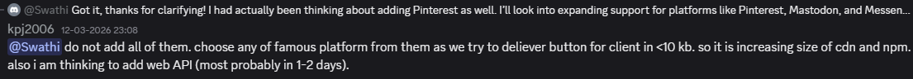
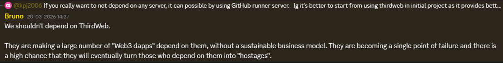
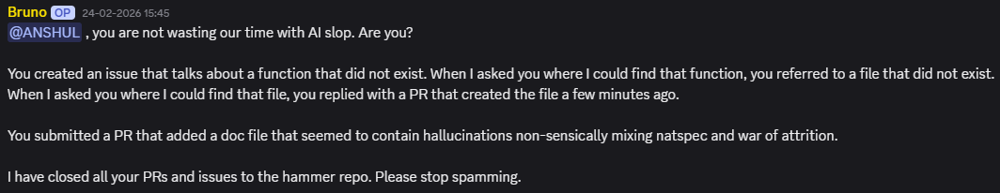

# Your AI assistant has never read our repo — and it shows

*Part 1 of 10 on organization-wide skills.*

I help maintain [SocialShareButton](https://github.com/AOSSIE-Org/SocialShareButton) at AOSSIE, and I spend a surprising share of my week explaining the same four or five things. Not because contributors aren't capable — most of them are sharp and fast. It's because the tools they use to move fast don't know anything about the project they're moving fast inside of.

Here's what that actually looks like.

## Constraints that exist nowhere the model can see

SocialShareButton ships a client bundle we keep under 10 KB. That number governs almost every design decision in the repo: which platforms we support, how the CDN build is assembled, whether a "small helper library" is acceptable. It is also completely invisible to any AI tool a contributor opens.

The suggestion — add Pinterest, Mastodon, Messenger — is a perfectly good suggestion for a generic share library. It's the wrong suggestion for *this* one. Nothing the contributor did was careless. The constraint simply wasn't in the room.

Same story with dependencies. We deliberately avoid depending on third-party hosted SDKs, because a dependency that can turn its users into hostages is a design risk, not a convenience.

An LLM trained on the median tutorial will recommend the hosted SDK every single time. It will also recommend a server-side approach for a library whose entire point is that it needs no server. That isn't hallucination — it's the statistical average of the internet, applied to a project that is deliberately not average.

## Confident output about code that doesn't exist

The harder failure is when the tool doesn't just miss context, it invents it.

An issue describing a function that isn't in the codebase. A file reference that resolves to a file created minutes earlier. A doc PR mixing unrelated concepts. Every artifact looks plausible, which is exactly what makes it expensive: a maintainer has to read all of it carefully before they can conclude there's nothing there. This one is AOSSIE's most-cited pain point for a reason — it's the failure mode that costs a maintainer's *reading* time, not just their typing time.

## What these two have in common

Neither is really an AI problem. They're **retrieval problems**. The knowledge that would have prevented both exists somewhere:

- the 10 KB budget → in a maintainer's head, and in one Discord message from March
- the dependency policy → in a Discord reply, phrased as a design argument
- the architecture that makes a hallucinated function checkable in seconds → distributed across the codebase, but not surfaced to whatever tool is about to write about it

It isn't missing from the organization. It's missing from the one place work actually gets done: the context window of whatever tool a contributor has open, in the first ten minutes of their attention on a new repo.

Multiply this by an org running 300+ repositories, and the shape of the problem changes. It stops being "maintainers should document better" and becomes an infrastructure question: **what is the artifact that carries repository-specific truth to whoever — or whatever — is about to write code?**

There's a second failure mode worth its own post: work that's technically fine but aimed at the wrong moment in a project's life. That, and the artifact that starts fixing both, are Part 2.

---

**Building this in the open as a GSoC 2026 project with AOSSIE:**
[Skills](https://github.com/AOSSIE-Org/Skills) · [SkillBot](https://github.com/AOSSIE-Org/SkillBot) · [PullRequestDashboard](https://github.com/AOSSIE-Org/PullRequestDashboard)

If your org has the same problem — many repos, few reviewers, contributors arriving with AI tools — I'd like to hear how it shows up for you. Issues and discussions are open.
