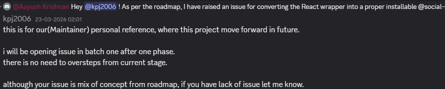
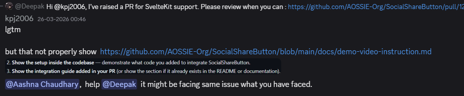

# Real work, aimed at the wrong moment

*Part 2 of 10 on organization-wide skills.*

[Part 1](blog-1-context-blind-ai.md) covered contributions that were wrong because the model never saw the constraint or invented the code. This one is subtler: work that's technically fine, and still wrong, because it skips the project's current step.

## An order that isn't visible from the roadmap file alone

A roadmap has a sequence for a reason. Issue batches get opened phase by phase, deliberately, so reviewers aren't triaging six unrelated fronts at once.



A contributor whose AI tool read `Roadmap.md` — but not the sequencing *intent* behind it — will happily open work for phase 3 while the repo is mid-phase-1. The document existed. What was missing was the reasoning that made the document make sense, and that reasoning lived in a maintainer's head, not in the file.

## Instructions that are written down and still don't land

The next one is worse, because there's no documentation gap to blame.



There is a `demo-video-instruction.md` in the repo. It's linked in the README. It still needed to be re-explained, per contributor, in the channel. The file was findable by any human who went looking. It was not findable by whatever tool a contributor had open while they were heads-down building — because nothing put it in front of them at the moment it mattered.

## The common thread

Both failures share a shape with Part 1's: the knowledge exists, it's just not *positioned* where work happens. A roadmap file without its sequencing rationale, and an instructions file nobody's tool reads, fail for the same reason a missing bundle-size constraint fails — they're one retrieval hop away from the person who needed them, and one retrieval hop is enough to lose most people.

## The artifact is a skill file

Not a wiki. Not a pinned message. A small set of Git-tracked markdown files that live in the repo, are written or approved by maintainers, and are structured so both humans and machines can retrieve the relevant piece:

```
skills/
├── AGENTS.md              # instructions for AI tools operating in this repo
├── core/
│   ├── architecture.md
│   ├── api-design.md
│   └── constraints.md     # "client bundle < 10 KB", "no hosted SDK deps"
├── setup/
├── patterns/
└── meta/
    ├── roadmap-summary.md
    ├── known-issues.md
    └── decision-log.md
```

That's the target shape — a proposal, not a claim that every repo already looks like this. Get it right and a contributor's assistant can answer "can I add three more platforms?" or "is this the right phase to open this?" correctly, before a maintainer has to.

But writing skill files for one repo is the easy part. The hard question is how you run this across hundreds of repositories without copy-pasting the same file into all of them — that's Part 3, and it runs the rest of this series.

---

**Building this in the open as a GSoC 2026 project with AOSSIE:**
[Skills](https://github.com/AOSSIE-Org/Skills) · [SkillBot](https://github.com/AOSSIE-Org/SkillBot) · [PullRequestDashboard](https://github.com/AOSSIE-Org/PullRequestDashboard)

If your org has the same problem — many repos, few reviewers, contributors arriving with AI tools — I'd like to hear how it shows up for you. Issues and discussions are open.
