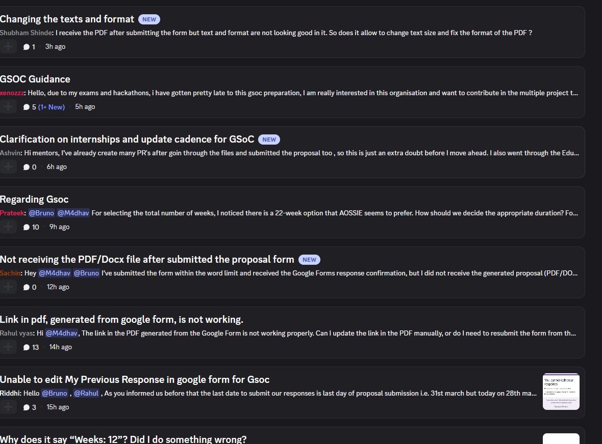

# SkillBot answering one contributor, function by function

*Part 5 of 10 on organization-wide skills.*

[Part 4](blog-4-what-skillbot-builds-today.md) drew the line between what's built and what's roadmap. This one walks the built part through a single real question, at the level of "which function runs, in what order" — because the fastest way to lose trust in a project like this is to describe it in the abstract and let the reader assume more machinery than exists.

Say someone posts in `#ai-chat`: *"why is my PR failing the bundle size check?"*

1. **Repo routing.** `repo_router.py` checks the message against `REPO_METADATA` — a fixed table of keywords per repo. "Bundle size" plus the channel context is enough to match `SocialShareButton`. If keyword matching had come up empty, an LLM classifier call would try next; if *that* still couldn't decide, the bot replies asking which project the question is about, and logs the gap as `repo_clarification_needed`.
2. **Context assembly.** With the repo resolved, the bot builds one prompt by concatenating, in this fixed order: `SocialShareButton/.agent/` instructions and info files, then any `skills/**/SKILL.md` in that repo, then the repo's `README.md` (first 2000 characters), then the shared `org-wide-skills/*/SKILL.md` files. Nothing here is ranked by relevance — it's the same four sections, same order, every query, for every repo.
3. **One model call.** That assembled context plus the question goes to Ollama (`llama3.2`), with `num_ctx` read from an environment variable — 4096 tokens by default, chosen because it's what Ollama already allocates at runtime on the maintainer's own machine, and because measured context loads for existing repos (roughly 900–1650 tokens) leave headroom under it.
4. **The answer, or a logged gap.** If the model responds, the contributor gets an answer grounded in whatever the concatenated context actually contained — including, in this case, the 10 KB constraint from `constraints.md` if that file exists for the repo. If Ollama is unreachable, or something throws mid-pipeline, or thread creation fails, one of four other fixed reasons gets written to `gap_log.json` instead: `no_repo_context`, `ollama_unavailable`, `processing_error`, `thread_creation_failed`.

Nothing in that path does similarity search or confidence scoring. It's keyword routing, then a fixed-order document concatenation, then one local model call. That's a smaller system than "vector search across a knowledge base," and it's also a system with far fewer places to fail silently — every failure has one of five named reasons, on the record.

## The one piece of polish that is real

Every query gets its own Discord thread, not a reply in the channel. That sounds cosmetic until you watch a busy channel without it.

Fifteen contributors asking different things in one channel is one long, interleaved conversation nobody can follow — including the bot, if it had to disambiguate which question a given message was answering. Scoping each query to its own thread turns that back into fifteen separate, individually resolvable conversations. It's a small mechanism, and unlike the vector-search and clustering ideas in the roadmap, it's actually shipped.

## What this buys, and what it doesn't

A repo-scoped assistant that never invents a policy it wasn't given is a real, useful thing — the contributor above gets an answer grounded in the actual bundle-size constraint, if that constraint is written down anywhere in the four sources the bot reads. It doesn't need a vector database to be worth using today. Claiming it already has one doesn't make it better; it just makes the gap between the docs and the code someone else's problem to discover later.

Part 6 does the same function-by-function walkthrough for PR Dashboard, with two real pull requests.

---

**Repositories:** [Skills](https://github.com/AOSSIE-Org/Skills) · [SkillBot](https://github.com/AOSSIE-Org/SkillBot) · [PullRequestDashboard](https://github.com/AOSSIE-Org/PullRequestDashboard)
