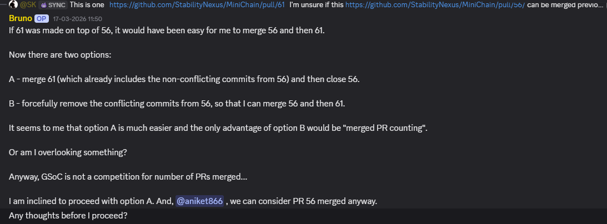

# PR Dashboard grouping two pull requests, function by function

*Part 6 of 10 on organization-wide skills.*

[Part 5](blog-5-skillbot-walkthrough.md) walked SkillBot through one contributor question. This one does the same for [PullRequestDashboard](https://github.com/AOSSIE-Org/PullRequestDashboard), with two pull requests that overlap.

Say two closed PRs against `StabilityNexus/MiniChain` both touch the same rate-limit config, from different contributors who didn't see each other's work.

1. **Fetch.** `main.py` shells out to `gh` for the PR list, then pulls each PR's file diff and CodeRabbit walkthrough summary.
2. **Embed and cluster — no LLM involved yet.** Each PR's change summary is embedded with `sentence-transformers` (`all-MiniLM-L6-v2`), and `community_detection` groups PRs whose cosine similarity clears 0.55, with a minimum cluster size of 2. Our two rate-limit PRs land in the same cluster.
3. **A fixed heuristic labels the cluster.** Average pairwise similarity within the cluster is checked against 0.75: above it, the cluster is labeled `duplicate`; at or below, `conflict`. This is a hard-coded threshold, not a judgment call — the same two numbers apply to every repo run through the pipeline.
4. **Ollama writes the explanation, after the fact.** Only now does `llama3.2` get called — once per cluster, and once per PR that didn't cluster with anything — to produce the natural-language write-up a maintainer reads. The grouping decision was already made before the model saw anything.
5. **Static output.** `render.py` writes two files, `conflicts_tree.html` and `isolated_prs.html`, and opens them in a browser. This is a one-shot CLI report generated by running `python main.py`, not a live web dashboard — and today it's hardcoded to one repo (`MiniChain`) analyzing already-*closed* PRs as a test set, rather than triaging an org's open queues.

Worth saying plainly: `scripts/update_subtrees.py` currently syncs skill context into a different set of repos than the one PR Dashboard analyzes, so the skill-aware part of that explanation step is a no-op today for MiniChain specifically. That's a fixable wiring gap, not a design flaw, and it's the kind of detail that's easy to lose if a description of the system only talks about what it's *supposed* to do.

## What this replaces, concretely

That's a maintainer holding two PRs, their overlap, their commit history, and the consequences of each ordering in their head simultaneously. With ten open PRs the pairwise comparisons stop being tractable, and the decision quietly becomes whichever PR was read most recently. This is exactly what the pipeline above targets — turning that mental juggling into labeled clusters a maintainer reads in order. That's a smaller claim than "a live merge-order graph computed on the fly," and it's also a claim that's actually true of the code that exists.

## Why this level of detail matters

Both SkillBot and PR Dashboard are legitimately useful tools as they stand — a repo-scoped assistant that never invents a policy it wasn't given, and a heuristic that turns an intractable pairwise comparison into two labeled clusters. Neither needs a vector database or a clustering-and-auto-edit loop to be worth using today. Claiming they already have that machinery doesn't make them better; it just makes the gap between the docs and the code someone else's problem to discover later.

Part 7 is about the one piece of this whole system that *is* a genuine feedback loop already running — the gap log — and how much further that loop has left to close before it reaches PR Dashboard or the skills tree at all.

---

**Repositories:** [Skills](https://github.com/AOSSIE-Org/Skills) · [SkillBot](https://github.com/AOSSIE-Org/SkillBot) · [PullRequestDashboard](https://github.com/AOSSIE-Org/PullRequestDashboard)
