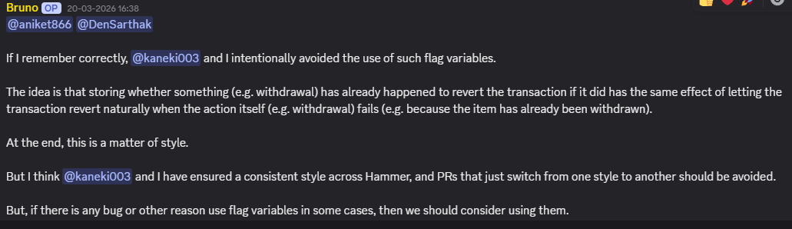

# Skills don't get smarter by sitting in Git

*Part 7 of 10 on organization-wide skills.*

[Part 2](blog-2-wrong-phase-right-artifact.md) argued that AI-assisted contributors fail because repository truth never reaches them. [Part 3](blog-3-org-wide-skills.md) argued that you can't fix that by copying a `skills/` folder into every repo. Both leave the same question open: where does new knowledge come from, and how does it get in?

Because the honest answer for most documentation is *it doesn't*. Someone writes it during a burst of enthusiasm, and it decays from that moment on. Meanwhile the real, current, correct version of the answer keeps being produced — in chat, several times a week.

Read that again as an artifact. It's a design decision, a rationale, a consistency rule, and an explicit escape hatch — better than most of what ends up in a contributing guide. It lives in a Discord thread from March. In three months a contributor will open a PR flipping that exact style, and a maintainer will type it out again.

## The one signal that's real today

SkillBot logs a gap every time it falls back past skills to the raw model, or fails outright — and it does this for exactly five reasons, no more: `repo_clarification_needed` (couldn't tell which project), `no_repo_context` (repo resolved but has nothing to load), `ollama_unavailable`, `processing_error`, and `thread_creation_failed`. Each entry is the question, the repo, and a timestamp.

That log is the most valuable file in the system, and I want to be honest about the state it's in: **nothing in the org's active code reads it back yet.** It's a ledger, not a loop. Every entry is a real, empirical data point about where documentation is thin — generated by the people who actually hit the missing part, no survey required — and today a human has to open the file and act on it manually.

## What's designed, not wired in

The idea that closes the loop — maintainer Discord messages get fetched, clustered by topic, matched against gap-log entries, and turned into a proposed skill-file edit for a maintainer to approve — is real, but it lives in a separate project, [`skill-updater`](https://github.com/kpj2006/skill-updater), that isn't integrated with SkillBot or the Skills repo yet. So the tidy version of the story —

> Contributor asks how to add a rate-limit rule → no skill matches → gap logged → the updater finds a maintainer message saying rate limits moved into `new-config.yaml` → proposes an edit to `skills/rate-limiting.md` → maintainer approves → the next contributor gets the correct answer instantly

— describes the destination, not a loop that runs today. Same for the idea that a merged PR gets checked against the skills index and flags a possibly-stale doc: PR Dashboard's clustering ([Part 6](blog-6-pr-dashboard-walkthrough.md)) groups PRs against each other, not against skill files. Both are real plans with real design thought behind them. Neither is running code yet, and I'd rather say that here than let an architecture diagram imply otherwise.

## What I'm actually claiming

Not that the loop is closed. That the hardest, most valuable part of it — a real, empirical, always-on record of exactly what documentation contributors are hitting the edge of — already exists and already works, and that the part left to build is turning that record into edits, with a human gate in front of every one. The bottleneck was never that maintainers don't document. It's that documenting is a separate act from answering, and today only the second one is automatic.

One real, working piece of "narrowing an ambiguous question" already exists in SkillBot, in a much narrower form than a full clarifying-question flow — that's worth a post of its own, next.

---

**Repositories:** [Skills](https://github.com/AOSSIE-Org/Skills) · [SkillBot](https://github.com/AOSSIE-Org/SkillBot) · [PullRequestDashboard](https://github.com/AOSSIE-Org/PullRequestDashboard)

If you maintain a multi-repo org and want to pilot this — or you think the human gate is in the wrong place — open a discussion. I'd rather hear that now than after it's built.
